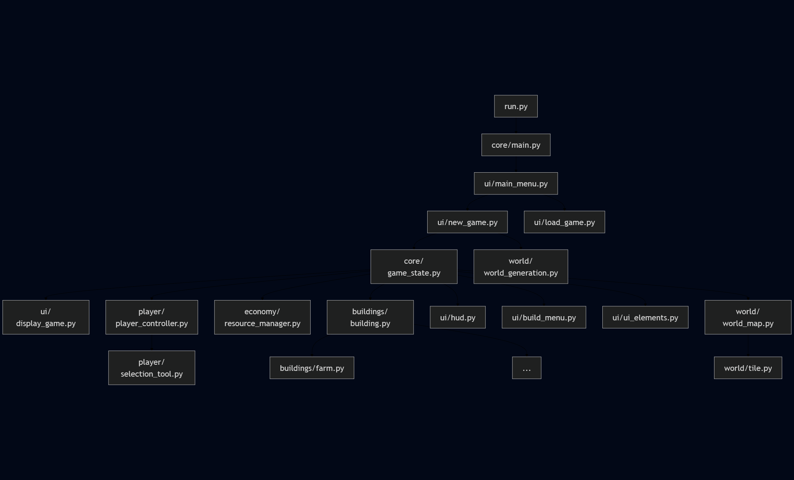

## Flowchart
Flowchart made with [Mermaid.js](https://mermaid.live)


## Theme
```
{
  "theme": "dark",
  "themeVariables": {
      "lineColor": "#000000",
      "primaryColor": "#000000",
      "primaryBorderColor": "#000000",
      "fontSize": "24px"
    }
}
```

## Flow
```
flowchart TD
A[run.py] --> B[core/main.py]
B --> C[ui/main_menu.py]

%% Main Menu Options
C --> D[ui/new_game.py]
C --> E[ui/load_game.py]

%% New Game Flow
D --> F[core/game_state.py]
D --> G[world/world_generation.py]

%% Generated world is saved to disk, then loaded into:
F --> H[ui/display_game.py]

%% Game State Systems
F --> I[player/player_controller.py]
F --> J[economy/resource_manager.py]
F --> K[buildings/building.py]
F --> L[ui/hud.py]
F --> M[ui/build_menu.py]
F --> N[ui/ui_elements.py]

%% World representation
F --> O[world/world_map.py]
O --> P[world/tile.py]

%% Player tools
I --> Q[player/selection_tool.py]

%% Building types
K --> R[buildings/farm.py]
K --> S[buildings/lumber_camp.py]
K --> T[buildings/house.py]
K --> U[...]  %% and more
```