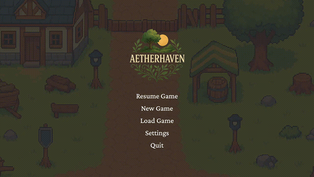

# Aetherhaven

Aetherhaven is a chill, top-down city builder focused on growth, exploration, and empire-building.  

You start small on a fixed size map, gathering wood, gold, and food.  From there, expand outward — no enemies, no combat (for now).  Just terrain, resources, and how far you can push your little civilization before it collapses.

## The Game Running So Far

## Flowchart
See [flow_diagram.md](flow_diagram.md)

## Contributing

Wanna help?  Fork it and open a pull request when you're ready for review.  Try to keep things clean and modular.  No giant god-files, please.

If you're adding a new system, try to keep function separated: ui where ui goes, utils where utils go, etc.. If you're fixing a bug, you're a real one.

I recommend you use **autopep8**.  I will be going through and doing this myself soon on the whole repo.

## TO-DO

1. ~~Basic PyGame window and main loop~~  
2. ~~Main menu UI (with dynamic resume + new game flow)~~  
3. ~~Procedural world generation (Voronoi + Simplex noise)~~  
4. ~~Tile-based map display with biomes and resources~~  
5. Add camera controls (pan & zoom)  
6. Build out unit system (worker, warrior, etc)  
7. UI elements: resource counters, build menu, tile info  
8. Add initial buildings (town center, farm, lumber camp, mine)  
9. Resource gathering & production logic  
10. Procedural map expansion (infinite scrolling world)  
11. Partial save/load system (auto-saves on new game, load support TBD)  
12. Replace placeholder assets with custom art  
13. Add ambient sound & background music  
14. Optimize rendering performance  
15. UI polish and animation  
16. Build packaging (standalone executable/installer)
